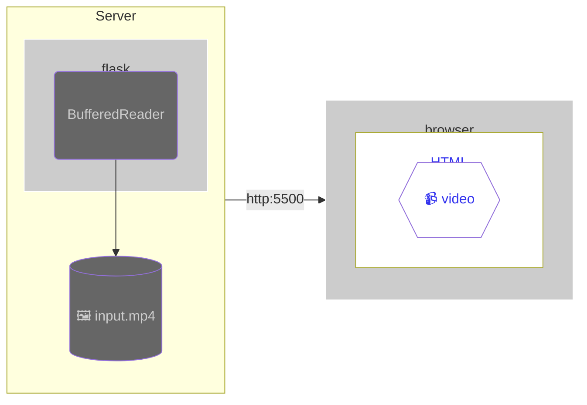

# Video streaming

## Table of Contents <!-- omit in toc -->

- [Video streaming](#video-streaming)
  - [Video chunk streaming example](#video-chunk-streaming-example)
    - [Composition](#composition)
    - [206 Partial Content](#206-partial-content)

## Video chunk streaming example

- [source](./chunks/)

### Composition

### 206 Partial Content

video タグで動画をホストする場合、レスポンスコード 200 では早送りなどの操作ができない場合があり、206 を強要する場合があるようです。

- [&lt;video&gt; - mdn](https://developer.mozilla.org/ja/docs/Web/HTML/Element/video)
- [206 Partial Content - mdn](https://developer.mozilla.org/ja/docs/Web/HTTP/Status/206)
