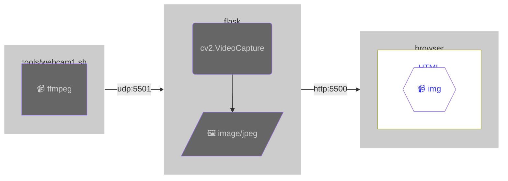

# Live streaming webcams

## Table of Contents <!-- omit in toc -->

- [Live streaming webcams](#live-streaming-webcams)
  - [Webcam streaming example for MJPEG](#webcam-streaming-example-for-mjpeg)
    - [Composition](#composition)
    - [MJPEG over HTTP](#mjpeg-over-http)
    - [マルチパート応答](#マルチパート応答)

## Webcam streaming example for MJPEG

- [source](./mjpeg/)

### Composition

### MJPEG over HTTP

JPEG を `multipart/x-mixed-replace` により HTTP で返し、動画としてレンダリングさせるものを MJPEG over HTTP と呼ぶことがあります。単に MJPEG や Motion JPEG と呼ぶこともあるようです。

### マルチパート応答

`Content-Type: multipart/x-mixed-replace: boundary=frame`

multipart/x-mixed-replace は、 HTTP応答によりサーバーが任意のタイミングで複数の文書を返し、 紙芝居的にレンダリングを切り替えさせるMIMEタイプです。
boundary （区切り文字）は必須パラメータで、指定された文字列の前に `--` を付けてパートを区切ります。
