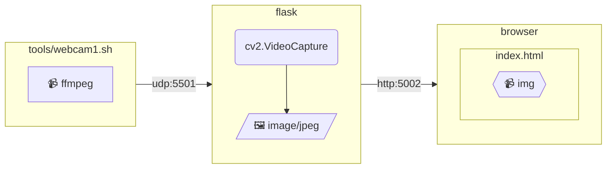
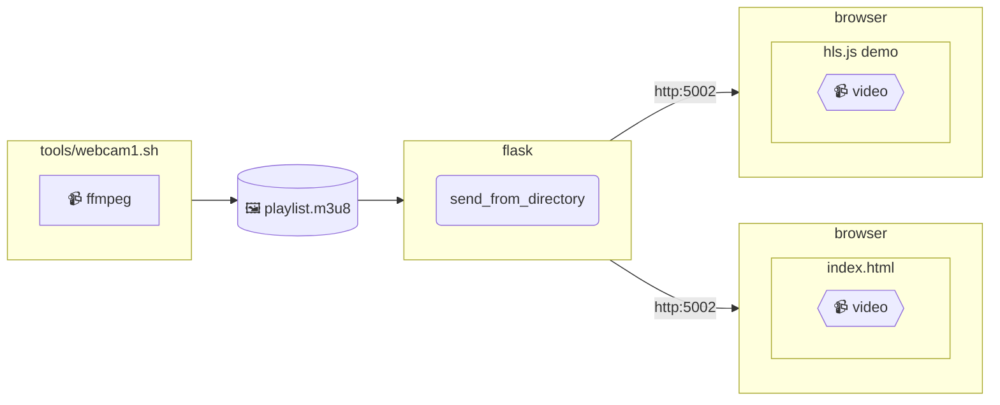

# Live streaming webcam

## Table of Contents <!-- omit in toc -->

- [Live streaming webcam](#live-streaming-webcam)
  - [Webcam streaming example for MJPEG](#webcam-streaming-example-for-mjpeg)
    - [Composition](#composition)
    - [FFmpeg options](#ffmpeg-options)
    - [MJPEG over HTTP](#mjpeg-over-http)
    - [マルチパート応答](#マルチパート応答)
  - [Webcam streaming example for HLS](#webcam-streaming-example-for-hls)
    - [Composition](#composition-1)
    - [FFmpeg options](#ffmpeg-options-1)
    - [hls.js](#hlsjs)
    - [Content-Type](#content-type)

## Webcam streaming example for MJPEG

- [source](./mjpeg/)

### Composition

### FFmpeg options

- [VideoToolbox - HWAccelIntro](https://trac.ffmpeg.org/wiki/HWAccelIntro#VideoToolbox)

### MJPEG over HTTP

JPEG を `multipart/x-mixed-replace` により HTTP で返し、動画としてレンダリングさせるものを MJPEG over HTTP と呼ぶことがあります。単に MJPEG や Motion JPEG と呼ぶこともあるようです。

### マルチパート応答

`Content-Type: multipart/x-mixed-replace: boundary=frame`

multipart/x-mixed-replace は、 HTTP応答によりサーバーが任意のタイミングで複数の文書を返し、 紙芝居的にレンダリングを切り替えさせるMIMEタイプです。
boundary （区切り文字）は必須パラメータで、指定された文字列の前に `--` を付けてパートを区切ります。

## Webcam streaming example for HLS

### Composition

### FFmpeg options

- [HLS - Formats ](https://ffmpeg.org/ffmpeg-formats.html#hls-2)

### hls.js

- https://hlsjs.video-dev.org/demo/

### Content-Type

[RFC 8216 - HTTP Live Streaming](https://tex2e.github.io/rfc-translater/html/rfc8216.html#4--Playlists):
- `application/vnd.apple.mpegurl` or `audio/mpegurl`

Microsoft?

- `applica:tion/x-mpegURL`
